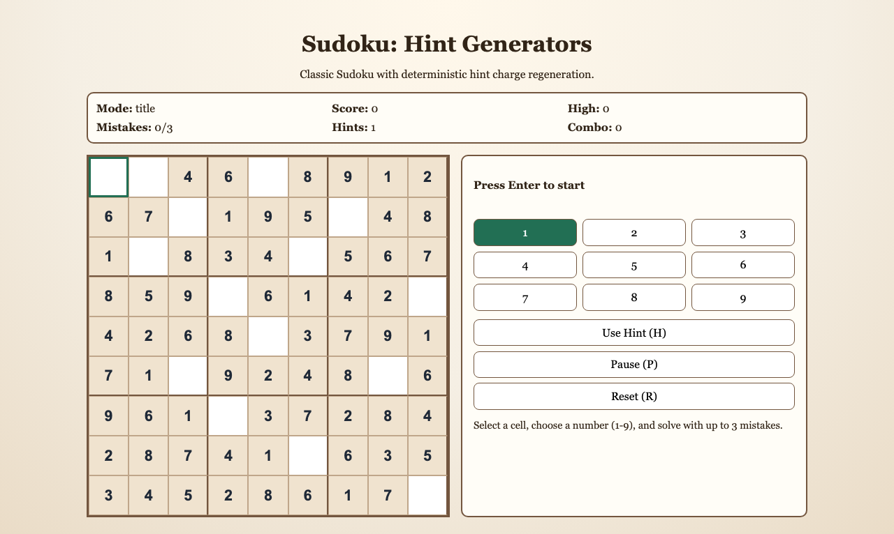
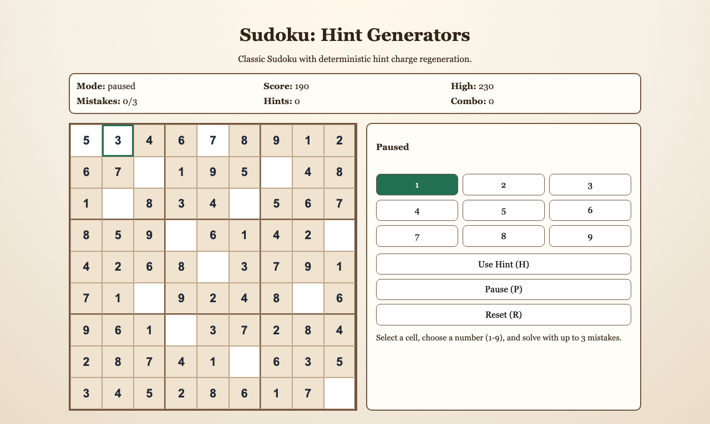

# daily-classic-game-2026-03-24-sudoku-hint-generators

<div align="center">
  <p>Sudoku rebuilt as a deterministic browser puzzle where hint charges regenerate over time, letting you recover from dead-ends without breaking the logic challenge.</p>
</div>

<div align="center">
  <p>
    
    
    
  </p>
</div>

## GIF Captures

- `Opening Grid`: `artifacts/playwright/clip-opening-grid.gif`
- `Hint Generator`: `artifacts/playwright/clip-hint-generator.gif`
- `Pause Reset Cycle`: `artifacts/playwright/clip-pause-reset-cycle.gif`

## Quick Start

```bash
pnpm install
pnpm test
pnpm build
pnpm capture
```

## How To Play

Press `Enter` to begin. Click any editable cell, then press a number key (`1-9`) to place a value. Use arrow keys to move the active selection and `Alt+1-9` to change the selected digit without placing.

## Rules

- Given cells are locked and cannot be edited.
- Wrong guesses increase mistakes; the run ends after `3` mistakes.
- Hint charges regenerate every `20` seconds while actively running.
- Pausing stops timer progress and hint generation until resumed.

## Scoring

- Correct placements award base points plus combo bonus.
- Incorrect placements apply a small score penalty and break combo.
- Using a hint consumes one charge and applies a score penalty.
- Solving the full board awards a completion bonus.

## Twist

This run uses the `hint generators` twist candidate from the catalog. Instead of static assists, hints are a renewable tactical resource, so timing each hint use becomes part of score optimization.

## Verification

- `pnpm test`
- `pnpm build`
- `pnpm capture`
- Browser hooks:
  - `window.advanceTime(ms)`
  - `window.render_game_to_text()`

## Project Layout

- `src/game-core.js`: deterministic Sudoku logic, scoring, hints, and hooks
- `src/main.js`: UI rendering, input wiring, and frame loop
- `tests/game-core.test.mjs`: deterministic logic checks
- `tests/capture.spec.mjs`: Playwright screenshots and action payload artifacts
- `artifacts/playwright/`: screenshots, GIF placeholders, action JSON, and render output
